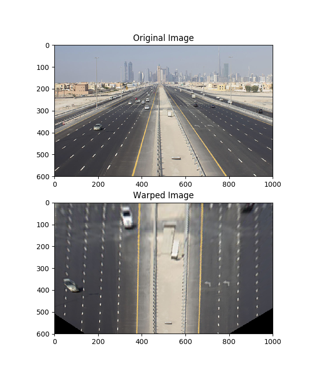

# Homography

This demonstrates how to implement homography matrix estimation given a set of source and destination points. It uses SVD method for solving a set of linear equations. Functions are implemented in ```homography.py``` and a test script is provided as ```test_homography.py```.


